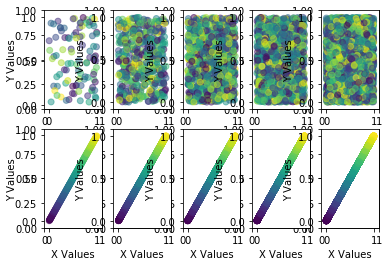

# Assignment 1 - Designing Models and Analyzing Data (Template)
(remove: **text between brackets to be removed**)

> * Participant name: Harry Skidmore
> * Project Title: (Escalators and the Importance of their Speed)

# General Introduction

The first part of this assignment explores designing models (and basic Python/Git features). 

We will look at **subway model in a city** system. A **subway system** is an underground, tube, or metro, underground railway system used to transport large numbers of passengers within urban and suburban areas - modern subways use different types of electronic data collection sensors to supply information which is used to manage assets and resources efficiently. 

The second part of the assignment explores data analysis. Data analysis and visualization is key to both the input and output of simulations. This assignment explores different random number generators, distributions, visualizations, and statistics. Additionally, it will look at getting you accustomed to specifying input and output variables to a system. We will also practice working with real data.

# Part 1: Designing a Model - Subway System

(Escalators are an essential part of subway systems. They are designed to take passengers down to point A or B, which could be subway platforms and to the surface. Escalators serve several important tasks, such as getting people to the train cars, or out of the subway. If there are problems with these escalators then there are problems with the subway systems.)

(There are several protential problems concerning escalators that need to be addressed if the system is to work correctly. One problem is if the escalators in the subway are not moving fast enough then people will not reach the platforms of the station on time to catch the trains to their destinations. The same issue also would cause in effect an overcrowding in the station.) 

(Historically subway systems have dealt with overcrowding, delays and accidents involving people trying to reach the platforms to catch they subway trains on time. This issue seemed to originate in the early 1800s when people needed to be transported to high areas such as train platforms in large numbers. The train statations would become filled with people and many delays or even accidents occured in the stations as a result. The speed of them became even more important to aleviate the flow of people.)

## (Part 1.1): Requirements (Experimental Design) **(10%)*

Cities face a issue of overcrowding with the subway systems due to people not reaching their trains on time or moving out of the station quickly. A subway escalator is a machine that raise and moves people from point A to B. Based on the issue of people not moving fast enough I hyothesize the escalator systme would help eleviate the issue of overcrowding if it can move the people out a partiulcar speed. It should also be noted that  My System Objectives are "How many people are moving?" "How fast does the escalator need to move?" How many people would the main room of the station and the platform hold till it was overcrowded? There would be two inputs, the speed of the escalator and the amount of people in the station. This is due to the fact that stations are built to only accomidate so many people and need to maintain this number legally. This helps prevent over crowding. It is imparative to then measure the output as the number of people in the station. It needs to be below the maximum number of people allowed in the station at any time. By testing different speeds and the number of people we will know what speed to run the escalators at to avoid overcrowding and know if it needs to be adjusted throughout the day. 

## (Part 1.2) Subway (My Problem) Model **(10%)**

(remove: add a high-level overview of your model, the part below should link to the model directory markdown files)
(remove: Look at the [**Object Diagram**](model/object_diagram.md) for how to structure this part of Part 2 for each diagram. Only the Object diagram has the template, the rest are blank. )

* [**Object Diagram**](model/object_diagram.md) - provides the high level overview of components
* [**Class Diagram**](model/class_diagram.md) - provides details of (what are you providing details of)
* [**Behavior Diagram**](model/behavior_diagram.md) - provides details of (what are you providing details of)
* [**Agent / User case** (if appropriate)](model/agent_usecase_diagram.md) - provides details of (what are you providing details of)

## (Part 1.3) Subway (My Problem) Simulation **(10%)**
I would simulate this by building a virtual subway system. The system would consist of a train platform, a entrance to the station with a wide attriume, both of which are connected by three escalators. The number of people will increase as the time goes by, so the speed needs to change with the amount of people who will come in. The controler of the simulation will then have to increase the speed of the escalators in order to prevent overcrowding in the station. The experimental hyptohesis will be that the controler needs to change speed needs to change as the day goes on, the null hyptohesis will be that the speed doesn't need to be increased. 

## (Part 1.4) Subway City (My Problem) Model **(10%)**
[**Code template**](code/README.md) - Starting coding framework for the (insert your exact problem here.)
You are expected to create the python files - the code should run without errors, create and object(s) for your system, but not provide function detail.

### (Part 1.5) Specifying the Inputs to a System **(10%)**

*Independent variable is the speed of the escalator and the number of people in the station. The dependent variable will be how close the number of people in the station is close to the capacity limit for the station
* The data will come from synthetic data.
* What kind of statistics are important to capture this input data
*The data will be analysised with simple statistics such as mean and standard deviation. These will be compared to the capacity of the train station entrance and platform 
* What ways will you visualize your data - charts, and graphs you will create?
  I will create a series of line graphs to show the number of people in the station throughout the day and show if it exceeds capacity.
* What clever way will you visualize your output with a useful infographic?

# Part 2: Creating a Model from Code

## (Part 2.1) **P**ortable **O**rganic **T**rouble-free **S**elf-watering System (**POTS**) Model **(10%)**
Here [**we provide an overview**](code/POTS_system/README.md) of the **P**ortable **O**rganic **T**rouble-free **S**elf-watering System (**POTS**) Model and provide a source code template for the code found in  [**the following folder**](code/POTS_system/). Please create a **class** diagram of this model (replace the placeholder diagram). (you can use paper and pencil or a digital tool).

# Part 3: Data Analysis

## (Part 3.1) - Real Data **(10%)**

Find a datasource that looks at part of this model - subway stations locations / escalator number, heights, widths / volume of passangers - ridership numbers   (*fits* - we are pretty loose here, it can be anything.)

The data is from the Chicago Transit Authority that documents the amount of people who use the bus and the rail system to get around. The data seems to just basically log how many people use either service day by day for over a year's time. The mean for the number of people who take the subway was 421353 people in a week in January, while the standard deviation was 184099. The mean for bus passangers though was 706798, which seems to suggest that many people in Chicago seem to perfer to take the bus rather then the subway. While the reason for this cannot be determined it could be that there is overcrowding and issues with the subway system that makes people decide to rather take the bus. The high number of people in the subway system in just a work week's time though does also show the importance of preventing overcrowding and issues in the subway. With so many people there, many could get hurt. 

* Visualize the raw data - visualize a few critical aspects of the data to better describe what it is, what it is showing, and why its useful to your system.
* Calculate and plot some summary statistics that better describe the data.

## (Part 3.2) -  Plotting 2D Random Number Generators **(15%)**

This portion of the assignment looks at generating random numbers in Python and understanding how to properly plot them. Plot two different random numbers, pseudo random and quasi random, for five different N values. There should be 10 subplots, all properly formatted 2D plots. Note, each of the N points will have two coordinates, an x and a y, therefore you will need to generate two random numbers for each point. You should replace the image with your results in a simalar format. Discuss how the patterns differ. Feel free to change the N values from the suggested N values in the image to state your case.
The patterns differ in terms of pseudo and quasi numbers, as well as amoungst themsevles. The scatter graphs for pseudos show an increase as the N number dramataicaully insreases and scatters over the state even more. 

## (Part 3.3) -  Plotting 1D Random Distributions **(15%)**

Now, choose three different distributions to plot in 1D, or as a histogram. Choose a pseudo-random generator and generate three different distributions. Example distributions are Uniform (part 8), Normal, Exponential, Poisson, and Chi-Squared, but feel free to use any three distributions of your choice. Again, plot each distribution for five different Ns. This will result in 15 different subplots, formatted similar to the image in Part 8. Include your properly formmated 1D plots below and breifly describe what we are looking at and how things change as N is changed.

Repeat the above using a quasi-random generator. Discuss the similarities and differences.
